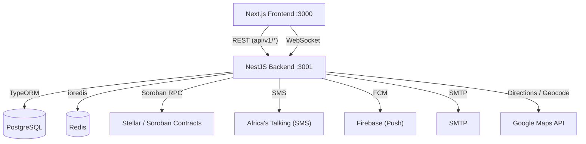
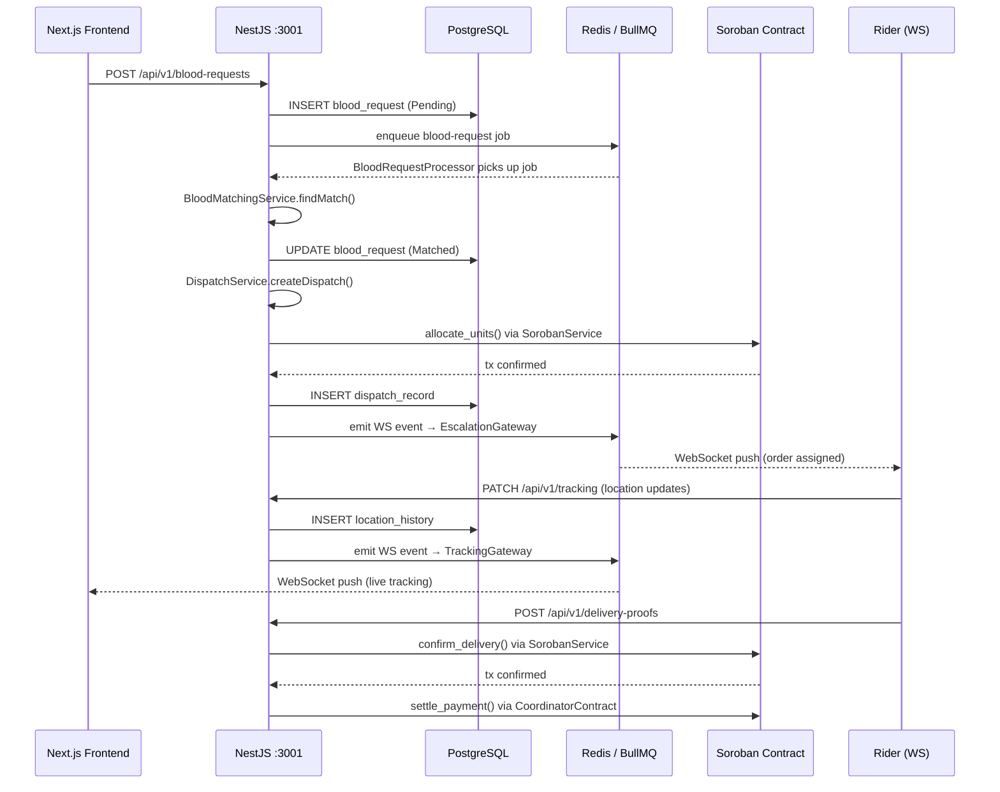
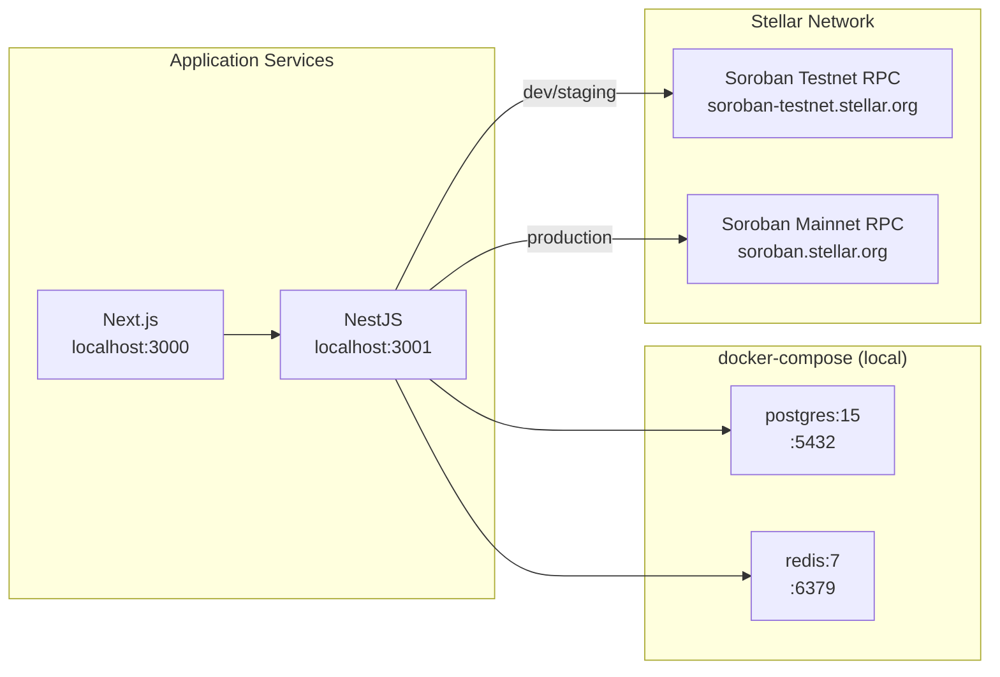

# HealthChain Stellar — Architecture

## System Overview

---

## Backend Module Boundaries

```mermaid
graph TD
    subgraph Core["Core Infrastructure"]
        AUTH[AuthModule]
        USERS[UsersModule]
        REDIS[RedisModule]
        CONFIG[AppConfigModule]
    end

    subgraph BloodSupplyChain["Blood Supply Chain"]
        BR[BloodRequestsModule]
        BU[BloodUnitsModule]
        INV[InventoryModule]
        BM[BloodMatchingModule]
        DISP[DispatchModule]
        TRACK[TrackingModule]
        CC[ColdChainModule]
        DP[DeliveryProofModule]
        CUST[CustodyModule]
    end

    subgraph Payments["Payments & Governance"]
        ESC[EscrowGovernanceModule]
        FEE[FeePolicyModule]
        FEEFIX[FeeCorrectionModule]
        REC[ReconciliationModule]
        DISPUTES[DisputesModule]
        PB[ProofBundleModule]
    end

    subgraph Actors["Actors"]
        HOSP[HospitalsModule]
        ORG[OrganizationsModule]
        RIDERS[RidersModule]
        DONA[DonationModule]
        DE[DonorEligibilityModule]
        DI[DonorImpactModule]
        REP[ReputationModule]
    end

    subgraph Blockchain["Blockchain"]
        SOROB[SorobanModule]
        CEI[ContractEventIndexerModule]
        BC[BlockchainModule]
    end

    subgraph Async["Async / Queue (BullMQ → Redis)"]
        WQ["blood-request queue\n→ BloodRequestProcessor"]
        NQ["notification queue\n→ NotificationProcessor"]
        STX["soroban-tx queue\n→ SorobanTxProcessor"]
        RQ["report-export queue\n→ ReportExportProcessor"]
        DO["donor-outreach queue\n→ DonorOutreachProcessor"]
    end

    subgraph WebSockets["WebSocket Gateways"]
        EG[EscalationGateway]
        LOG[LiveOpsGateway]
        TG[TrackingGateway]
        NG[NotificationsGateway]
        OG[OrdersGateway]
        RLG[RiderLocationGateway]
        RDG[RouteDeviationGateway]
    end

    subgraph Observability["Observability"]
        HEALTH[HealthModule]
        SLA[SlaModule]
        ANALY[AnomalyModule]
        READY[ReadinessModule]
        REPORT[ReportingModule]
        ANALYT[contract-event-indexer analytics]
    end

    AUTH --> USERS
    BR --> WQ
    BC --> STX
    NOTIF[NotificationsModule] --> NQ
    REPORT --> RQ
    INV --> DO

    BR --> EG
    DISP --> LOG
    TRACK --> TG
    NOTIF --> NG
    ORDERS[OrdersModule] --> OG
    RIDERS --> RLG
    RD_MOD[RouteDeviationModule] --> RDG

    SOROB --> SC[("Soroban RPC")]
    CEI --> SOROB
    BC --> SOROB
```

---

## Data Flow — Blood Request Lifecycle

---

## Infrastructure Layout

---

## Key Environment Variables

| Variable | Purpose | Default |
|---|---|---|
| `PORT` | NestJS listen port | `3001` |
| `DATABASE_*` | PostgreSQL connection | `localhost:5432` |
| `REDIS_HOST` / `REDIS_PORT` | Redis + BullMQ | `localhost:6379` |
| `SOROBAN_RPC_URL` | Stellar Soroban RPC | testnet URL |
| `SOROBAN_NETWORK` | `testnet` or `mainnet` | `testnet` |
| `JWT_SECRET` | Auth signing key | — |
| `CORS_ORIGIN` | Allowed frontend origins | `http://localhost:3000` |

See `backend/.env.example` for the full list.
